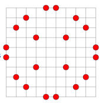

# μProjet Polytech 2023

μProjet PEIP1, INFO 4 de Polytech Nantes. Année 2023

## Projet

Les 3 points non alignés de Erdös
Dans un carré de NxN points, on cherche à placer le plus de points possible sur la grille de sorte que l'on n'ai pas 3 points alignéscomme sur la fgure suivante (ici N=10). On veut connaître les surfaces de tous les triangles possibles construit par 3 de ces points. On étudiera tous les cas possibles pour un coté du carré inférieur à 30.

On pourra aussi calculer la même chose pour le même nombre de points disposés au hasard

Researches :
https://en.wikipedia.org/wiki/No-three-in-line_problem
